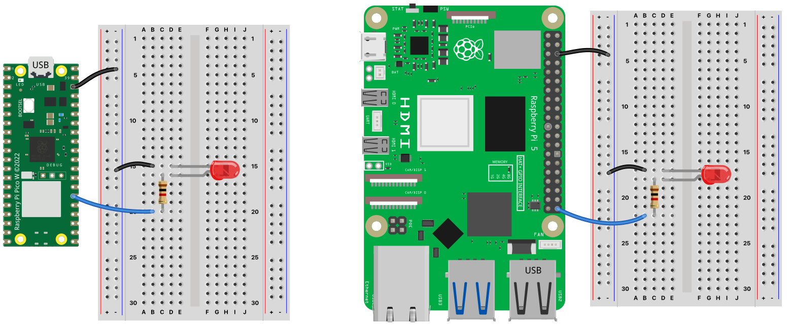

# Practical Python Programming for IoT 2nd Edition

## Chapter 3 - Networking with RESTful APIs

* `breadboard_layout.fzz` - Fritzing breadboard layouts circuits for Raspberry Pi &amp; Pico
* `breadboard_layout.png` - Breadboard layouts circuits for Raspberry Pi &amp; Pico

* `rpi` folder - Raspberry Pi Python Code

  * `requirements.txt` - Python dependencies required for this chapter
  * `flask_api_server_rpi.py` - RESTful API Server to control a LED
  * `templates/index_api_client.html` - Web client for `flask_api_server_rpi.py`
  * `static/jquery.min.js` - JQuery JavaScript library for the web client

* `pico` folder - Pico MicroPython Code

  * `microdot_api_server_pico.py` - RESTful API Server to control a LED
  * `templates/index_api_client.html` - Web client for `microdot_api_server_pico.py`
  * `static/jquery.min.js` - JQuery JavaScript library for the web client
  * `picowifi.py` - Helper code for connecting Pico W to Wireless network
  * `wifi_credentials.example.py` - example WiFi credentials file
  * `microdot` - this folder contains the Microdot library and dependencies
  * `utemplates` - this folder contains the utemplates library required my Microdot

### Datasheets

None

### Post Publication Updates and Errata

None

### Breadboard Layouts

